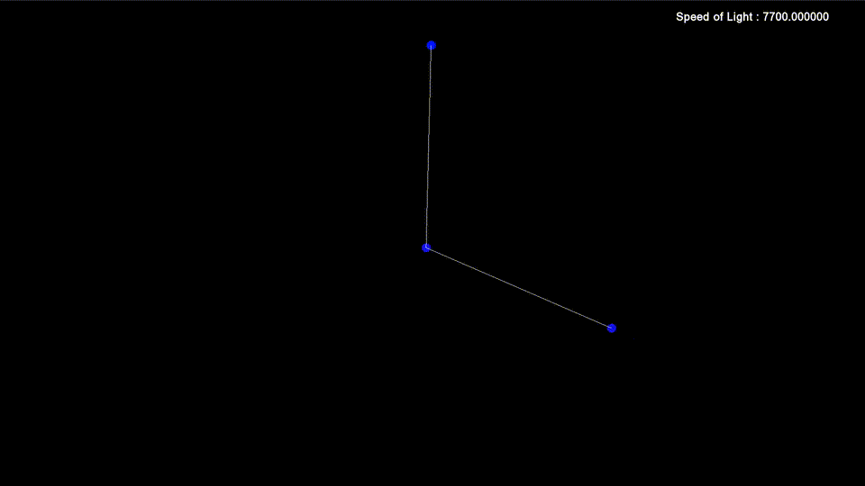

# High-Performance 2D Relativistic Physics Engine

**Status:** v1.0 (Stable Release)

| **Fluid Dynamics (Quadtree)** | **Relativistic Collider** |
|:---:|:---:|
|  |  |
| *2,000+ particles at 144 FPS* | *Lorentz Contraction & Redshift* |

| **Constraint Stability (Cloth)** | **Chaotic Dynamics (Pendulum)** |
|:---:|:---:|
|  |  |
| *Verlet Integration with Sub-stepping* | *Sensitive dependence on initial conditions* |

## Overview
A custom-built 2D physics simulation engine written in **C++** using **SFML**. 

Unlike standard rigid body simulations, this engine integrates **Special Relativity** into the solver, simulating effects like length contraction and relativistic mass scaling in real-time with a dynamically adjustable speed of light. It is optimized using a dynamic **Quadtree** spatial partitioning system, allowing for the simulation of thousands of interacting bodies at high frame rates. The user can interact dynamically by picking and dragging any object on screen.

## Key Features

### Optimization & Architecture
-   **Quadtree Spatial Partitioning:** Implemented a recursive Quadtree structure to optimize collision detection from $O(N^2)$ to $O(N \log N)$, enabling simulations of **5,000+ particles** in real-time at 144FPS.
-   **Memory Management:** Trees are initialised at the start and reused to avoid memory allocation overhead.
-   **Separation of Concerns:** Decoupled `Solver` (Physics), `Renderer` (Visuals), `Input`, and `Object`(Objects) systems for a clean, extensible architecture.
-   **User Interaction:** Objects can be clicked and dragged dynamically using a mouse. The momentum is retained once the object is dropped(or thrown).

### Physics & Simulation
-   **Verlet Integration:** Uses position-based dynamics ($x_{n+1} = 2x_n - x_{n-1} + a \cdot dt^2$) with **sub-stepping** (turned off by default).
-   **Special Relativity:**
    -   **Kinematics:** Enforces the universal speed limit ($c$).
    -   **Visuals:** Renders **Lorentz Contraction** (spatial squashing) and **Relativistic Doppler Shift** (Redshift/Blueshift) based on particle velocity. As a particle's velocity moves closer to the speed of light, it turns red from blue.
    -   **Dynamics:** Collisions account for **Relativistic Mass** increase ($\gamma m_0$), causing fast particles to have higher effective inertia.
-   **Constraints:** Distance constraints for simulating ropes, chains, and tearable cloth.

## The Math

### Verlet Solver
Velocity is implicitly calculated from the difference between current and previous positions, offering superior stability over Euler methods for constrained systems.
```cpp
velocity = position - last_position
new_position = position + velocity + acceleration * (dt * dt)
```

### Relativistic Corrections
The engine simulates relativistic effects using the Lorentz factor $\gamma$:
$$ \gamma = \frac{1}{\sqrt{1 - v^2/c^2}} $$
*   **Visuals:** Objects are scaled by $1/\gamma$ along the velocity vector.
*   **Collisions:** Collision response is weighted by relativistic mass $m = \gamma m_0$.

## Build & Usage

### Prerequisites
*   C++17 Compiler
*   CMake
*   SFML Library

### Compilation
```bash
git clone https://github.com/Jedop/CPP-Physics-Engine.git
cd CPP-Physics-Engine
mkdir build && cd build
cmake -DCMAKE_BUILD_TYPE=Release ..
make
```

### Running Scenarios
The engine includes a CLI Scene Manager. Run the executable with flags to load specific demos:

```bash
# 1. Fluid Simulation (Performance Test)
./bin/PhysicsEngine --fluid

# 2. Relativistic Collider (High Speed Physics)
./bin/PhysicsEngine --collider

# 3. Cloth Simulation (Constraint Stability)
./bin/PhysicsEngine --cloth

# 4. Double Pendulum (Chaos Theory)
./bin/PhysicsEngine --pendulum
```
**Note: Use Up/Down arrows to adjust the Speed of Light ($c$) in real-time.**

## Tech Stack
*   **Language:** C++17
*   **Graphics:** SFML
*   **Build System:** CMake

---